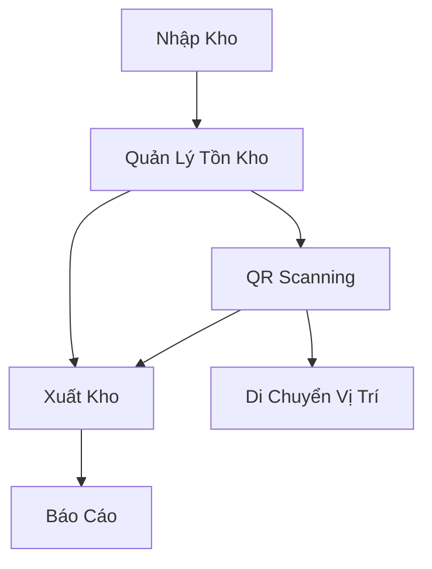
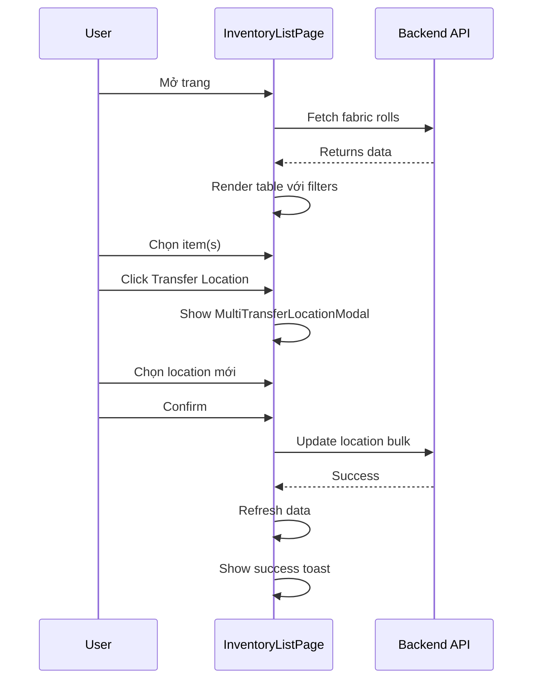
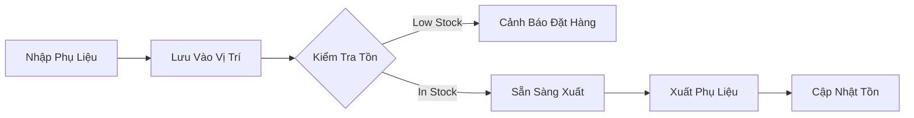
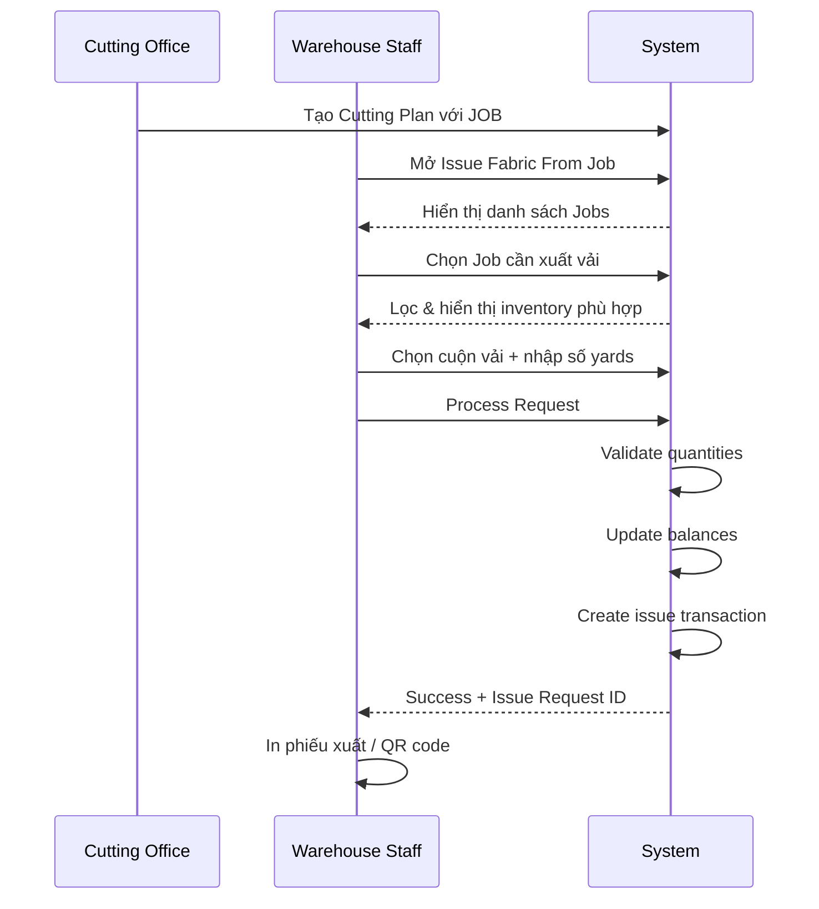
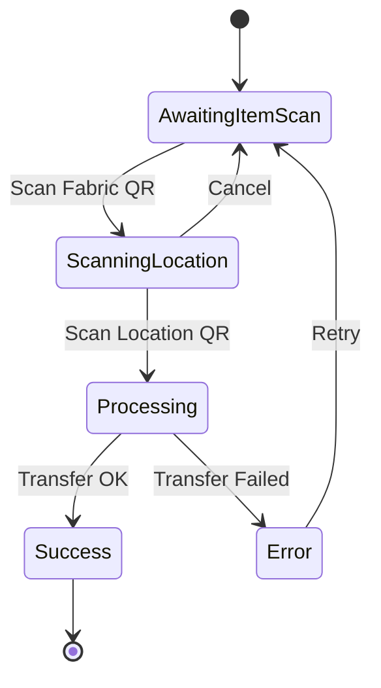
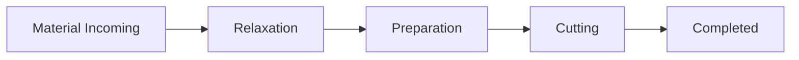
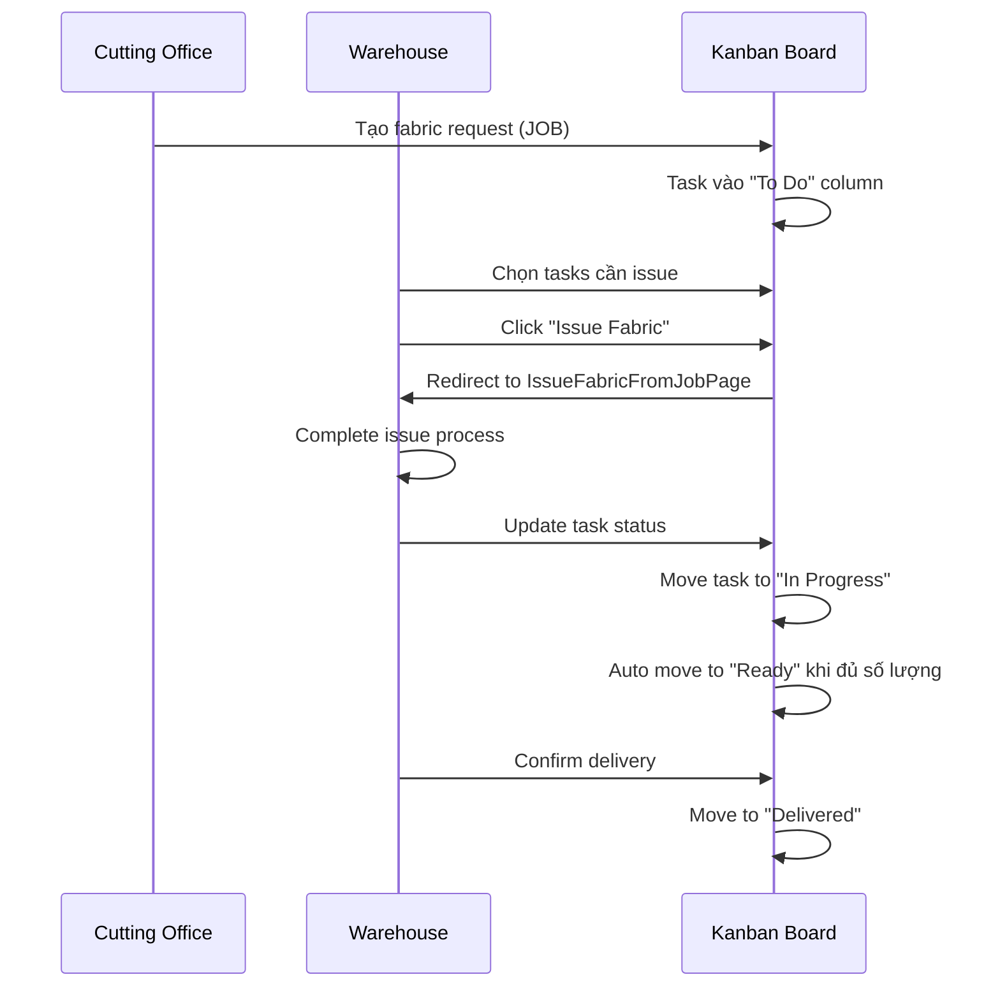
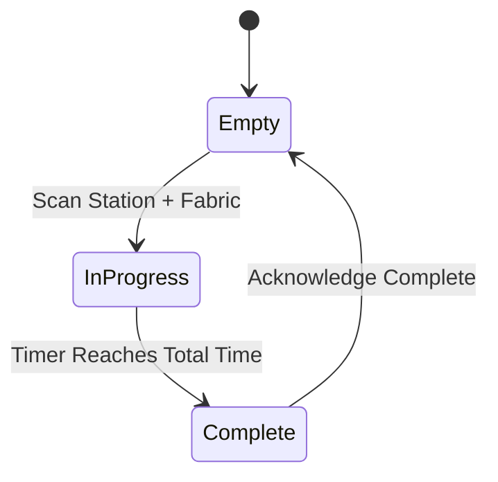
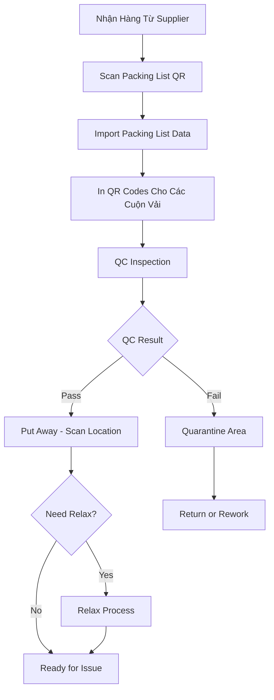
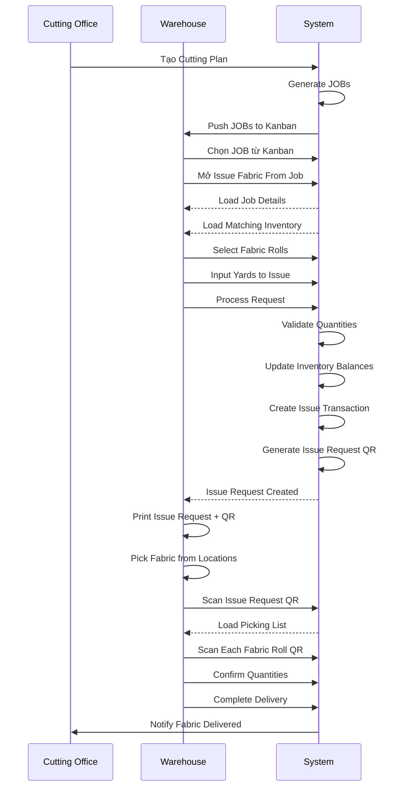

# TÀI LIỆU CHI TIẾT MODULE WAREHOUSE

> **Mục đích**: Tài liệu này mô tả chi tiết các màn hình trong module Warehouse, giúp developers hiểu rõ cấu trúc giao diện, luồng nghiệp vụ và cách implement chính xác.

## Mục Lục

1. [Tổng Quan Module](#1-tổng-quan-module)
2. [Nhóm Quản Lý Tồn Kho](#2-nhóm-quản-lý-tồn-kho)
3. [Nhóm Xuất Kho](#3-nhóm-xuất-kho)
4. [Nhóm QR Scanning](#4-nhóm-qr-scanning)
5. [Nhóm Dashboard & Kanban](#5-nhóm-dashboard--kanban)
6. [Nhóm Quy Trình Đặc Biệt](#6-nhóm-quy-trình-đặc-biệt)
7. [Luồng Nghiệp Vụ Tổng Quan](#7-luồng-nghiệp-vụ-tổng-quan)

---

## 1. Tổng Quan Module

Module Warehouse quản lý toàn bộ quy trình kho từ nhập - lưu trữ - xuất hàng, bao gồm:
- **Vải (Fabric)**: Nguyên liệu chính cho sản xuất
- **Phụ liệu (Accessory)**: Nút, khóa kéo, nhãn mác, v.v.
- **Bao bì (Packaging)**: Vật liệu đóng gói sản phẩm

### Kiến Trúc Chung



### Components Dùng Chung

Tất cả màn hình warehouse sử dụng:
- `CustomTable` từ `@/components/ui/custom-table`
- Shadcn UI components (Button, Card, Dialog, Badge, v.v.)  
- React Tanstack Table cho data tables
- React Hot Toast cho notifications

---

## 2. Nhóm Quản Lý Tồn Kho

### 2.1. InventoryListPage

**File**: `InventoryListPage.tsx` (1128 dòng)

**Chức năng**: Quản lý danh sách cuộn vải trong kho

#### Cấu Trúc Dữ Liệu

```typescript
interface FabricRoll {
  id: string
  poNumber: string        // Số PO
  itemCode: string        // Mã item
  factory: string         // Factory
  supplier: string        // Nhà cung cấp
  supplierCode: string
  invoiceNo: string       // Số hóa đơn
  colorCode: string
  color: string
  rollNo: string          // Số cuộn
  lotNo: string          // Số lô
  yards: number          // Số yards
  netWeightKgs: number   
  grossWeightKgs: number
  width: string          // Chiều rộng
  dateInHouse: string    // Ngày nhập kho
  qcStatus: "Pass" | "Pending" | "Fail"
  qcDate: string
  qcBy: string
  comment: string
  printed: boolean       // Đã in QR chưa
  balanceYards: number   // Yards còn lại
  location: string       // Vị trí kho
  needRelax: "Yes" | "No"
  hourStandard: number   // Giờ tiêu chuẩn relax
  hourRelax: number      // Giờ đã relax
  relaxDate: string
  relaxTime: string
  relaxBy: string
  parentQrCode: string | null
  locationHistory: LocationHistoryEntry[]
}
```

#### Giao Diện

**Header Actions**:
- Export All: Xuất toàn bộ
- Export Selected: Xuất items đã chọn
- Print Multiple QR: In nhiều QR cùng lúc
- Transfer Location: Chuyển vị trí hàng loạt
- View History: Xem lịch sử nhiều cuộn
- Delete: Xóa items đã chọn

**Filters**:
- PO Number
- Item Code
- Invoice No
- Supplier
- Color Name/Code
- Date In House (from-to)
- QC Status (Pass/Pending/Fail)
- Location
- Need Relax (Yes/No)
- Printed Status

**Table Columns**:
| Column | Description | Features |
|--------|-------------|----------|
| Checkbox | Chọn hàng loạt | Có header checkbox chọn tất cả |
| PO Number | Số PO | Sortable, có link |
| Item Code | Mã vải | Sortable |
| Supplier | Nhà cung cấp | Filterable |
| Color | Màu sắc | Hiển thị code + tên |
| Roll No | Số cuộn | - |
| Yards/Balance | Yards gốc/còn lại | Progress bar |
| QC Status | Trạng thái QC | Badge màu |
| Location | Vị trí kho | Badge |
| Need Relax | Cần relax không | Badge Yes/No |
| Relax Progress | Tiến độ relax | Progress bar + timer |
| Actions | Thao tác | Dropdown menu |

**Row Actions** (Dropdown):
- View Details: Xem chi tiết cuộn vải
- Print QR: In mã QR  
- Transfer Location: Chuyển vị trí
- View History: Xem lịch sử di chuyển
- Delete: Xóa

#### Modals

**1. FabricRollDetailModal**
- Hiển thị đầy đủ thông tin cuộn vải
- Chia sections: Basic Info, Weight & Dimensions, QC Info, Relax Info, Location

**2. MultiTransferLocationModal**
- Transfer nhiều cuộn cùng lúc
- Select location mới
- Hiển thị danh sách items sẽ chuyển

**3. MultiLocationHistoryModal**
- Xem lịch sử di chuyển của nhiều cuộn
- Table hiển thị: Date Time, From, To, Changed By

#### Luồng Nghiệp Vụ



#### Implementation Notes

**Skeleton Loading**:
- `FilterSkeleton`: Hiển thị khi filters đang load
- `TableSkeleton`: Hiển thị khi table data đang load

**Performance**:
- Sử dụng `useMemo` cho filtered data
- Pagination để hạn chế số rows render
- Virtual scrolling nếu danh sách quá dài

**Relax Progress Bar**:
```typescript
// Tính progress dựa trên thời gian
const calculateProgress = () => {
  if (!roll.needRelax || roll.needRelax === "No") return 100
  if (!roll.relaxTime) return 0
  const elapsed = roll.hourRelax
  const total = roll.hourStandard
  return (elapsed / total) * 100
}
```

---

### 2.2. AccessoryInventoryListPage

**File**: `AccessoryInventoryListPage.tsx` (884 dòng)

**Chức năng**: Quản lý danh sách phụ liệu trong kho

#### Cấu Trúc Dữ Liệu

```typescript
interface AccessoryItem {
  id: string
  qrCode: string
  itemNumber: string
  itemCategory: string      // Loại phụ liệu (Button, Zipper, Label,...)
  materialName: string
  color: string
  size: string
  quantity: number
  unit: string              // Đơn vị (pcs, set, roll,...)
  location: string
  requiredQuantity: number
  status: "In Stock" | "Low Stock" | "Out of Stock"
  batchNumber: string
  dateReceived: string
  supplier: string
  poNumber: string
  reorderPoint: number      // Điểm đặt hàng lại
  lastModifiedDate: string
  lastModifiedBy: string
  description: string
}
```

#### Giao Diện

**Header Actions**:
- Print Multiple QR
- Export to Excel

**Filters**:
- Search (Item Number, Material Name)
- Item Category
- Location
- Stock Status

**Table Columns**:
| Column | Description | Features |
|--------|-------------|----------|
| Checkbox | Chọn items | - |
| QR Code | Mã QR | Hiển thị text |
| Item Number | Mã phụ liệu | Link, sortable |
| Category | Loại | Badge |
| Material | Tên vật liệu | - |
| Color | Màu | Badge |
| Size | Kích thước | - |
| Quantity | Số lượng | Có đơn vị |
| Location | Vị trí | Badge |
| Status | Trạng thái tồn | Badge màu theo status |
| Actions | Thao tác | Dropdown |

**Row Actions**:
- View Details: Xem chi tiết
- Print QR: In mã QR
- Transfer Location: Chuyển vị trí
- Issue: Xuất phụ liệu

#### Modals

**1. AccessoryDetailModal**
- Hiển thị full thông tin accessory
- Sections: Basic Info, Stock Info, Supplier Info

**2. TransferLocationDialog**
- Form chuyển vị trí cho 1 item
- Input: New location
- Confirm để update

**3. IssueAccessoryDialog**  
- Form xuất phụ liệu
- Input: Quantity to issue
- Validate: quantity <= available quantity
- Update balance sau khi issue

#### Luồng Nghiệp Vụ



---

### 2.3. PackagingInventoryListPage

**File**: `PackagingInventoryListPage.tsx`

**Chức năng**: Quản lý danh sách bao bì trong kho

Tương tự như AccessoryInventoryListPage nhưng cho packaging materials:
- Carton boxes
- Poly bags
- Labels
- Tape, v.v.

---

## 3. Nhóm Xuất Kho

### 3.1. IssueFabricFromJobPage

**File**: `IssueFabricFromJobPage.tsx` (1189 dòng)

**Chức năng**: Xuất vải theo yêu cầu của JOB từ cutting plan

#### Cấu Trúc Dữ Liệu

**Cutting Plan Job**:
```typescript
interface CuttingPlanJob {
  ID: string
  PlanName: string
  Factory: string
  PlanDate: string
  Style: string
  JOB: string
  Lot: string
  PONumber: string
  ItemCode: string
  Color: string
  ColorCode: string
  RequestQuantity: number
  IssuedQuantity: number
  Status: "Planned" | "In Progress" | "Completed"
  QCStatus: "Pass" | "Fail"
  CreatedBy: string
  Remarks: string
  erpChecked: boolean
  qcChecked: boolean
}
```

**Inventory Roll (để chọn xuất)**:
```typescript
interface InventoryRoll {
  // ... all fields from FabricRoll
  BalanceYards: number
}

interface SelectedInventoryRoll extends InventoryRoll {
  issuedYards: number  // Số yards sẽ xuất từ cuộn này
}
```

#### Giao Diện

**Bước 1: Select Cutting Plan Job**

- Table hiển thị danh sách cutting plan jobs
- Filters: Plan Name, Factory, Style, JOB, PO Number, Status
- Checkboxes: ERP Checked, QC Pass Only
- Columns: 
  - Checkbox (chọn job)
  - JOB, Style, Item Code, Color
  - Request Qty, Issued Qty, Balance
  - Status badges
- Click vào row hoặc "Select" button để chọn job

**Bước 2: Select Inventory Rolls**

Sau khi chọn job, hiển thị 2 panels:

**Panel trái - Selected Job Info**:
- Job details
- Item Code, Color cần xuất
- Request Quantity vs Issued Quantity

**Panel phải - Available Inventory**:
- Table các cuộn vải khả dụng (matching Item Code + Color)
- Filters: Supplier, Location, QC Status
- Columns:
  - Roll No, Lot No
  - Balance Yards
  - Location
  - QC Status
  - Input field: Issued Yards (nhập số yards muốn xuất)
  - Checkbox: Chọn cuộn này
- Summary panel:
  - Total Selected Yards
  - Remaining to fulfill
  - Progress bar

**Bước 3: Confirm & Process**

- Review selected rolls và quantities
- Button "Process Fabric Request"
- Hiển thị confirmation dialog
- Sau khi confirm:
  - Cập nhật IssuedQuantity của job
  - Giảm BalanceYards của các cuộn vải
  - Log transaction
  - Tạo issue request record

#### Luồng Nghiệp Vụ



#### Implementation Notes

**Validation**:
- Tổng issued yards không được vượt quá request quantity
- Issued yards từ mỗi cuộn không được vượt quá balance yards
- Chỉ được chọn các cuộn đã QC Pass

**Auto-matching Logic**:
```typescript
// Tự động filter inventory theo job
const matchedInventory = allInventory.filter(roll => 
  roll.ItemCode === job.ItemCode &&
  roll.ColorCode === job.ColorCode &&
  roll.BalanceYards > 0 &&
  roll.qcStatus === "Pass"
)
```

**Smart Selection**:
- Gợi ý chọn cuộn có balance yards gần bằng remaining quantity
- FIFO: Ưu tiên cuộn cũ hơn (by DateInHouse)

---

### 3.2. IssueAccessoryFormPage

**File**: `IssueAccessoryFormPage.tsx`

**Chức năng**: Form xuất phụ liệu

#### Giao Diện

**Form Fields**:
- Cutting Plan / Work Order (select)
- Accessory Item (select from inventory)
- Quantity to Issue (number input)
- Destination (text - cutting line, sewing line, etc.)
- Remarks (textarea)

**Display Info After Selection**:
- Current Stock
- Available Quantity
- Unit of Measure

**Actions**:
- Submit: Tạo issue transaction
- Cancel: Quay lại

#### Luồng

1. Chọn cutting plan/work order
2. Chọn accessory item từ inventory
3. Nhập quantity
4. System validate quantity <= available
5. Confirm và tạo issue record
6. Update accessory inventory balance

---

### 3.3. IssuePackag ingFormPage

Tương tự IssueAccessoryFormPage nhưng cho packaging materials.

---

### 3.4. IssueTransactionReportsPage

**File**: `IssueTransactionReportsPage.tsx` (848 dòng)

**Chức năng**: Báo cáo các giao dịch xuất vải

#### Giao Diện

**Filters**:
- Date Range (from - to)
- Supplier
- QC Status
- Search (PO, Item Code, Color)

**Table Columns**:
- PO Number
- Item Code
- Factory
- Supplier
- Invoice No
- Color Code, Color Name
- Roll No, Lot No
- Yards Issued
- Destination (Cutting line, etc.)
- Issued Date
- Issued By
- JOB (destination job)

**Actions**:
- Export to Excel
- Download Report PDF

**Summary Section**:
- Total Transactions
- Total Yards Issued
- Breakdown by Supplier
- Breakdown by Destination

#### Implementation

```typescript
// Aggregate data for summary
const summary = useMemo(() => {
  const totalYards = transactions.reduce((sum, t) => sum + t.yards, 0)
  const bySupplier = transactions.reduce((acc, t) => {
    acc[t.supplier] = (acc[t.supplier] || 0) + t.yards
    return acc
  }, {})
  return { totalYards, bySupplier }
}, [transactions])
```

---

## 4. Nhóm QR Scanning

### 4.1. ScanQRFabric

**File**: `ScanQRFabric.tsx` (437 dòng)

**Chức năng**: Quét QR code vải để thực hiện transfer location

#### Giao Diện

**Scanner Component**:
- Camera preview (simulated)
- QR frame overlay
- Status message
- Simulate buttons (cho testing)

**Flow States**:

**State 1: AWAITING_ITEM_SCAN**
- Prompt: "Scan a Fabric Roll QR Code to start a Transfer"
- Chờ quét QR cuộn vải

**State 2: SCANNING_NEW_LOCATION**
- Hiển thị thông tin cuộn vải đã quét
- Prompt: "Scan the QR code of the NEW WAREHOUSE LOCATION"
- Chờ quét QR vị trí mới
- Button Cancel để quay lại

**State 3: PROCESSING**
- Hiển thị spinner
- Message: "Processing location transfer..."

**State 4: FEEDBACK** 
- Success: Green checkmark + message
- Error: Red error icon + message
- Button "Start New Scan" hoặc "Try Again"

#### Luồng Nghiệp Vụ



#### Implementation Notes

**QR Data Structure**:
```typescript
// Item QR
{
  qrCode: "ITEM_QR_FAB_001",
  type: "item",
  sku: string,
  name: string,
  currentLocation: string | null,
  // ... other fields
}

// Location QR
{
  qrCode: "LOC_QR_A_01_B",
  type: "location",
  locationCode: string,
  description: string
}
```

**Validation**:
- Fabric phải có currentLocation (không thể transfer nếu chưa put away)
- Location QR phải valid
- Không được transfer đến cùng location hiện tại

**API Call**:
```typescript
const submitTransferAction = async (item, newLocation) => {
  const response = await api.post('/warehouse/transfer', {
    itemQrCode: item.qrCode,
    fromLocation: item.currentLocation,
    toLocation: newLocation.locationCode,
    timestamp: new Date().toISOString(),
    userId: currentUser.id
  })
  return response
}
```

---

### 4.2. ScanQRIssueRequest

**File**: `ScanQRIssueRequest.tsx`

**Chức năng**: Quét QR của phiếu xuất kho để pick items

#### Flow

1. Quét QR Issue Request → Load picking list
2. Hiển thị danh sách items cần pick
3. Để pick, quét QR từng item
4. Nhập quantity picked
5. Mark item as picked
6. Khi hoàn thành tất cả → Confirm delivery

#### Giao Diện

**After Scanning Issue Request**:
- Issue Request Info: ID, Destination, Status
- Picking List Table:
  - SKU, Name, UOM
  - Required Qty
  - Picked Qty
  - Progress bar
  - Locations (where to find)
  - Button "Scan Item"

**Scanning Item**:
- Verify item matches picking list
- Input quantity picked
- Add to picked quantity
- Update progress

---

### 4.3. ScanQRWarehouseLocation

**Chức năng**: Quét QR vị trí kho để xem items tại vị trí đó

#### Luồng

1. Quét QR Location
2. Hiển thị thông tin location
3. Hiển thị danh sách items tại location đó
4. Actions: Print location label, View capacity, etc.

---

## 5. Nhóm Dashboard & Kanban

### 5.1. InboundDashboardPage

**File**: `InboundDashboardPage.tsx` (548 dòng)

**Chức năng**: Dashboard theo dõi quy trình nhập kho và chuẩn bị vải

#### Giao Diện

**Header & Filters**:
- Title: "Dashboard"
- Date Range picker (from - to)
- JOB NO search
- Fabric Type select
- Filter button

**KPI Cards** (7 cards):
1. Total Jobs In Progress
2. Jobs Incoming  
3. Jobs in Relaxation
4. Jobs in Preparation
5. Jobs in Cutting
6. Avg. Prep Time
7. On-time Rate

**Chart Area** (Grid 3-2):

**Left Column** (Performance Analysis):
- **Preparation Performance (m)**: Bar chart
  - Actual vs Target by day
  - X-axis: Days (Mon-Fri)
  - Y-axis: Meters
- **Relaxation Output (m)**: Bar chart
  - Output by day

**Right Column** (Flow & WIP):
- **Job Status Distribution**: Pie chart
  - Slices: Incoming, Relaxation, Preparation, Cutting, Completed
- **Work in Progress Over Time**: Area chart
  - Stacked area showing WIP by status
  - X-axis: Days  
  - Y-axis: Number of jobs

**Detail Table**:
- All jobs with columns:
  - JOB NO, Fabric Type, Quantity
  - Status (badge with colors)
  - Creation Date
  - Planned Completion
  - Assigned To

#### Luồng Business



**Status Flow**:
- **Incoming**: Vải đã order, chờ về kho
- **Relaxation**: Đang trong quá trình relax (fabric needs to rest)
- **Preparation**: Chuẩn bị, kiểm tra, xếp kho
- **Cutting**: Đã xuất cho cutting line
- **Completed**: Hoàn thành

#### Implementation

**Data Structure**:
```typescript
interface Job {
  JOB_NO: string
  Fabric_Type: string
  Quantity: number
  UoM: "m" | "kg" | "pcs"
  Status: "Incoming" | "Relaxation" | "Preparation" | "Cutting" | "Completed"
  Created_Timestamp: string
  Planned_Completion_Date: string
  Assigned_User: string
  // Optional timestamps for each stage
  Relaxation_Start_Timestamp?: string
  Relaxation_End_Timestamp?: string
  Preparation_Start_Timestamp?: string
  Preparation_End_Timestamp?: string
  // etc.
}
```

**Charts with ECharts**:
```typescript
import ReactECharts from "echarts-for-react"

const option: EChartsOption = {
  title: { text: "Job Status Distribution" },
  tooltip: { trigger: "item" },
  series: [{
    type: "pie",
    data: [
      { value: incomingCount, name: "Incoming" },
      // ...
    ]
  }]
}

return <ReactECharts option={option} style={{ height: 300 }} />
```

---

### 5.2. KanbanBoardPage

**File**: `KanbanBoardPage.tsx` (555 dòng)

**Chức năng**: Kanban board để track fabric issuance từ warehouse tới cutting

#### Giao Diện

**Header**:
- Title: "Kanban board for FBWH from cutting office"
- Description

**Filters Card**:
- From Date, To Date
- Factory select
- Button: "Issue Fabric (X)" - X = số tasks đã chọn

**Kanban Columns** (4 columns):

1. **To Do**
   - Tasks đang chờ prepare
   - Có thể chọn để issue
   
2. **In Progress**
   - Tasks đang được prepare
   - Có thể chọn để issue
   
3. **Ready for Delivery**
   - Tasks đã sẵn sàng
   - KHÔNG thể chọn (auto process)
   
4. **Delivered**
   - Tasks đã giao
   - KHÔNG thể chọn

#### Kanban Card

**Card Layout**:
```
┌─────────────────────────────┐
│ [✓] JOB-101      📅 20/10/25│
│     [⋯]                     │
├─────────────────────────────┤
│ Fabric CTN-005 - White      │
└─────────────────────────────┘
```

**Card Data**:
- Checkbox (chỉ ở To Do & In Progress columns)
- JOB number
- Due date icon + date
- More menu (⋯)
- Fabric title

**Click More Menu**:
- Opens `TaskDetailsModal`

#### TaskDetailsModal

Hiển thị full thông tin:
- Request ID, JOB
- Item, Style, Factory
- Plan Date
- Progress: Issued Qty / Request Qty
- Priority badge (Urgent/High/Normal)
- Assignee avatar + name
- Remarks

#### Luồng Nghiệp Vụ



#### Implementation

**Selection Logic**:
```typescript
// Column 1, 2 có thể select
const nonSelectableColumnIds = ["col-3", "col-4"]

const isColumnSelectable = !nonSelectableColumnIds.includes(column.id)
```

**Filter by Date & Factory**:
```typescript
const filteredTaskIds = useMemo(() => {
  return tasks.filter(task => {
    const taskDate = parseDate(task.dueDate) // "20/10/2025"
    const dateMatch = (!startDate || taskDate >= startDate) &&
                     (!endDate || taskDate <= endDate)
    const factoryMatch = factoryFilter === "all" || 
                         task.factory === factoryFilter
    return dateMatch && factoryMatch
  }).map(t => t.id)
}, [startDate, endDate, factoryFilter])
```

**Bulk Issue**:
- Chọn nhiều tasks từ different columns
- Click "Issue Fabric (X)"
- Mở IssueFabricFromJobPage với pre-selected jobs

---

### 5.3. SewingTrimsKanbanPage

Tương tự KanbanBoardPage nhưng cho phụ liệu may (sewing trims).

---

## 6. Nhóm Quy Trình Đặc Biệt

### 6.1. FabricRelaxScreen

**File**: `FabricRelaxScreen.tsx` (341 dòng)

**Chức năng**: Quản lý quy trình relax vải tại các máy relax

#### Khái Niệm Relax

**Relax** là quá trình để vải "nghỉ" sau khi về kho, cho vải ổn định về kích thước trước khi cắt may. Vải cần relax trong một khoảng thời gian nhất định (vd: 24-48 giờ) tùy loại vải.

#### Giao Diện

**Header**:
- Title: "Fabric Relaxation Management"
- Description: "Real-time monitoring of the fabric relaxation process"
- Button: "Scan" (mở scan dialog)

**Relax Stations Grid** (8 stations):

Mỗi station card hiển thị:
- **Header**: Machine name + Status badge
- **Content**:
  - Fabric ID
  - Progress bar
  - Timer: "HH:MM:SS / HH:MM:SS" (elapsed / total)
- **Footer**:
  - Empty: "Scan QR to assign fabric"
  - In Progress: "Relaxation in progress..."
  - Complete: Button "Acknowledge Complete"

**Status Colors**:
- Empty: Gray badge
- In Progress: Yellow badge
- Complete: Green badge

#### Scan Dialog

**2-step scan process**:

**Step 1: Scan Station QR**
- Prompt: "1. Scan Station QR Code"  
- QR camera view
- Button: "Simulate Station Scan"
- Validates: Station must be Empty

**Step 2: Scan Fabric QR**
- Prompt: "2. Scan Fabric for '[Station Name]'"
- QR camera view
- Button: "Simulate Fabric Scan"
- On success: Start timer immediately

#### Luồng Nghiệp Vụ



#### Implementation

**State Management**:
```typescript
interface RelaxStation {
  id: number
  machineName: string
  status: "Empty" | "InProgress" | "Complete"
  fabricId: string | null
  startTime: number | null      // timestamp when started
  elapsedTime: number           // seconds elapsed
  totalTime: number             // total seconds required
}

// Timer effect
useEffect(() => {
  const timer = setInterval(() => {
    setStations(prev => prev.map(station => {
      if (station.status === "InProgress" && station.startTime) {
        const elapsed = Math.floor((Date.now() - station.startTime) / 1000)
        if (elapsed >= station.totalTime) {
          return { ...station, status: "Complete", elapsedTime: station.totalTime }
        }
        return { ...station, elapsedTime: elapsed }
      }
      return station
    }))
  }, 1000)
  return () => clearInterval(timer)
}, [])
```

**Progress Calculation**:
```typescript
const progressPercentage = (elapsedTime / totalTime) * 100
```

**Multi-station Management**:
- 8 stations có thể chạy parallel
- Real-time monitoring tất cả stations
- Auto-complete khi đến thời gian

---

### 6.2. RelaxTimeStandardPage

**File**: `RelaxTimeStandardPage.tsx`

**Chức năng**: Quản lý tiêu chuẩn thời gian relax cho từng loại vải

#### Giao Diện

Table CRUD:
- Fabric Type (Cotton, Polyester, Silk, etc.)
- Standard Relax Hours
- Description
- Actions: Edit, Delete

Form thêm/sửa:
- Fabric Type (select hoặc input)
- Standard Hours (number)
- Description (textarea)

#### Sử dụng

Khi assign fabric to relax station, system sẽ:
1. Look up fabric type
2. Get standard hours từ bảng này
3. Set `totalTime` cho station

---

### 6.3. ActionPlanPage

**File**: `ActionPlanPage.tsx`

**Chức năng**: Kế hoạch hành động cho các vấn đề trong warehouse

Thường dùng để track:
- Issues cần resolve (missing items, wrong quantities, etc.)
- Improvement plans
- Maintenance schedules

#### Giao Diện

**Filters**:
- Status (Open, In Progress, Resolved)
- Priority
- Assigned To
- Due Date

**Table**:
- Issue ID
- Description
- Priority
- Assigned To
- Due Date
- Status
- Actions

**Form Create/Edit**:
- Title
- Description
- Priority (High/Medium/Low)
- Assigned To (select user)
- Due Date
- Related Item (link tới fabric roll, accessory, etc.)
- Action steps (checklist)
- Attachments

---

## 7. Luồng Nghiệp Vụ Tổng Quan

### 7.1. Luồng Nhập Kho Vải



**Chi Tiết Các Bước**:

1. **Nhận hàng**: Warehouse nhận container/shipment từ supplier
2. **Scan Packing List**: Quét QR trên packing list document
3. **Import**: Hệ thống tạo records cho tất cả fabric rolls trong packing list
4. **In QR**: In physical QR labels cho từng cuộn vải
5. **QC**: Quality control team kiểm tra physical
6. **Put Away**: Scan cuộn vải + scan location để lưu vị trí
7. **Relax** (nếu cần): Đưa vào relax station
8. **Ready**: Vải sẵn sàng được xuất cho production

---

### 7.2. Luồng Xuất Kho Vải



**Chi Tiết**:

1. **Cutting Office** tạo cutting plan với JOBs
2. **Warehouse** thấy JOBs trên Kanban board
3. Select JOB cần xuất → Mở Issue Fabric Page
4. System hiển thị các cuộn vải matching (item code, color, QC pass)
5. WH staff chọn cuộn và nhập số yards
6. Process → system validate và tạo issue request
7. In QR code cho issue request này
8. WH staff sử dụng QR scanning để pick items theo picking list
9. Confirm delivery → Update status trên Kanban

---

### 7.3. Luồng QR Scanning Transfer Location

```mermaid
graph LR
    A[Open Scan Screen] --> B[Scan Fabric QR]
    B --> C{Has Location?}
    C -->|No| D[Error: Must Put Away First]
    C -->|Yes| E[Display Fabric Info]
    E --> F[Scan New Location QR]
    F --> G[Validate Location]
    G --> H[Submit Transfer]
    H --> I[Update Database]
    I --> J [Log History]
    J --> K[Success Message]
```

---

## 8. Patterns & Best Practices

### 8.1. Common UI Patterns

**Table with Filters**:
```typescript
// Pattern dùng chung cho tất cả inventory pages
const [filters, setFilters] = useState({ ... })
const [data, setData] = useState([])

const filteredData = useMemo(() => {
  return data.filter(item => {
    // Apply filters
    return matchesFilter(item, filters)
  })
}, [data, filters])

return (
  <>
    <FiltersComponent filters={filters} onChange={setFilters} />
    <CustomTable data={filteredData} columns={columns} />
  </>
)
```

**Modal Pattern**:
```typescript
const [modalState, setModalState] = useState<{
  type: "details" | "transfer" | "issue" | null
  data: any | null
}>({ type: null, data: null })

const openModal = (type, data) => setModalState({ type, data })
const closeModal = () => setModalState({ type: null, data: null })

return (
  <>
    {/* Triggers */}
    <Button onClick={() => openModal("details", item)}>View</Button>
    
    {/* Modals */}
    <DetailsModal 
      open={modalState.type === "details"}
      onOpenChange={closeModal}
      data={modalState.data}
    />
  </>
)
```

### 8.2. State Management

**Local State** (useState):
- UI state (modal open/close, selected items, filters)
- Form inputs

**API State**:
- Fetch data on mount
- Optimistic updates cho better UX
- Error handling với toast notifications

### 8.3. Performance

**Memoization**:
```typescript
// Expensive calculations
const summary = useMemo(() => computeSummary(data), [data])

// Callbacks passed to children
const handleAction = useCallback((id) => { ... }, [dependencies])
```

**Virtual Scrolling**:
- Cho tables có >100 rows
- Render only visible rows

**Pagination**:
- Server-side pagination cho large datasets

### 8.4. Validation

**Client-side**:
```typescript
const validateQuantity = (issued: number, available: number) => {
  if (issued <= 0) return "Quantity must be > 0"
  if (issued > available) return "Exceeds available quantity"
  return null
}
```

**Server-side**:
- Always validate lại trên server
- Return clear error messages

---

## 9. Testing Guide

### 9.1. Unit Tests

Test các utility functions:
```typescript
// formatTime.test.ts
describe('formatTime', () => {
  it('formats seconds to HH:MM:SS', () => {
    expect(formatTime(3665)).toBe('01:01:05')
  })
})
```

### 9.2. Integration Tests

Test components với mock data:
```typescript
// InventoryListPage.test.tsx
describe('InventoryListPage', () => {
  it('filters data by PO number', () => {
    render(<InventoryListPage />)
    fireEvent.change(screen.getByLabelText('PO Number'), {
      target: { value: 'PO-001' }
    })
    expect(screen.getByText('PO-001')).toBeInTheDocument()
    expect(screen.queryByText('PO-002')).not.toBeInTheDocument()
  })
})
```

### 9.3. E2E Tests

Test full user flows:
```typescript
// issue-fabric.spec.ts
test('issue fabric from job flow', async ({ page }) => {
  await page.goto('/warehouse/issue-fabric-from-job')
  await page.click('[data-testid="job-row-1"]')
  await page.fill('[data-testid="issued-yards-1"]', '100')
  await page.click('[data-testid="process-button"]')
  await expect(page.locator('[data-testid="success-message"]')).toBeVisible()
})
```

---

## 10. API Integration

### 10.1. API Endpoints

**Inventory**:
```
GET    /api/warehouse/inventory/fabric
GET    /api/warehouse/inventory/accessory
GET    /api/warehouse/inventory/packaging
POST   /api/warehouse/inventory/transfer
PUT    /api/warehouse/inventory/:id
DELETE /api/warehouse/inventory/:id
```

**Issue**:
```
GET    /api/warehouse/cutting-plans
POST   /api/warehouse/issue-fabric
POST   /api/warehouse/issue-accessory
GET    /api/warehouse/issue-transactions
```

**QR Scanning**:
```
GET    /api/warehouse/qr/:qrCode
POST   /api/warehouse/qr/transfer
POST   /api/warehouse/qr/put-away
```

### 10.2. API Service Pattern

```typescript
// services/warehouseApi.ts
import axios from 'axios'

export const warehouseApi = {
  getFabricInventory: (filters) => 
    axios.get('/api/warehouse/inventory/fabric', { params: filters }),
  
  transferLocation: (itemId, newLocation) =>
    axios.post('/api/warehouse/inventory/transfer', {
      itemId,
      newLocation,
      timestamp: new Date().toISOString()
    }),
  
  issueFabric: (jobId, rolls) =>
    axios.post('/api/warehouse/issue-fabric', { jobId, rolls })
}
```

---

## Kết Luận

Module Warehouse là một hệ thống phức tạp quản lý toàn bộ quy trình kho từ nhập đến xuất. Khi implement:

✅ **Follow PATTERNS đã thiết lập** trong các file hiện có
✅ **Consistent UX** across tất cả các screens
✅ **Validate** thoroughly ở cả client và server
✅ **Error handling** với clear messages cho user
✅ **Performance** optimization cho large datasets
✅ **Mobile-friendly** UI cho warehouse floor use

Tham khảo code hiện có làm example, especially:
- `InventoryListPage.tsx` cho table patterns
- `IssueFabricFromJobPage.tsx` cho complex multi-step forms
- `ScanQRFabric.tsx` cho QR scanning flows
- `InboundDashboardPage.tsx` cho charts và KPIs
